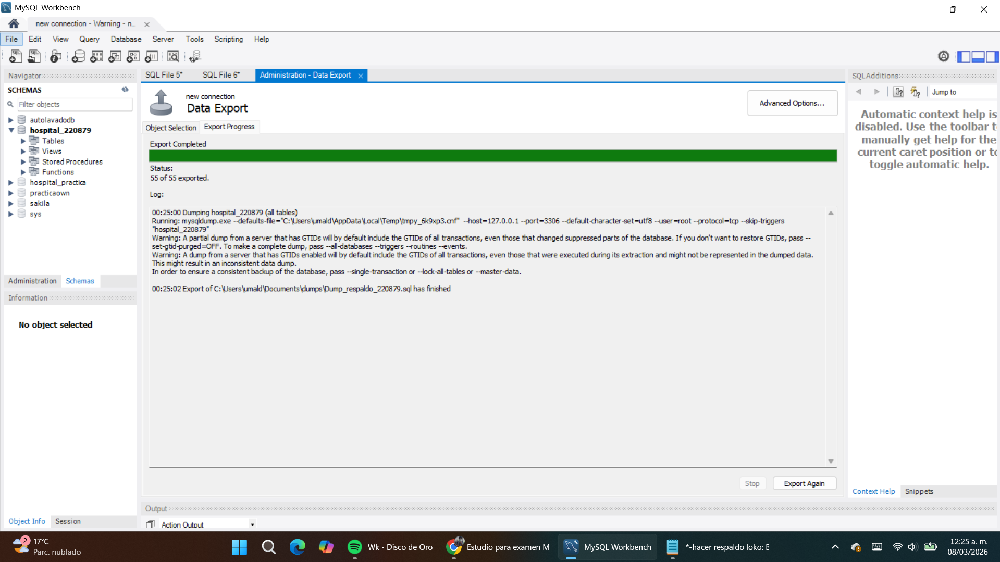
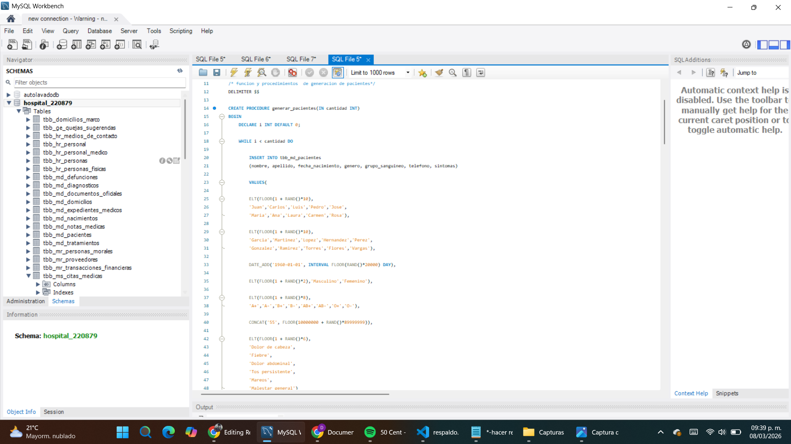
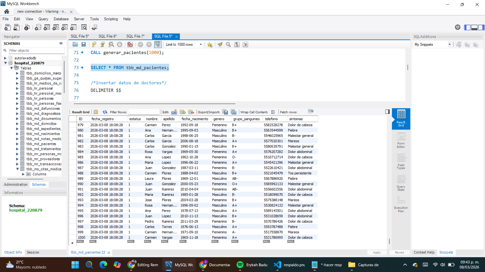
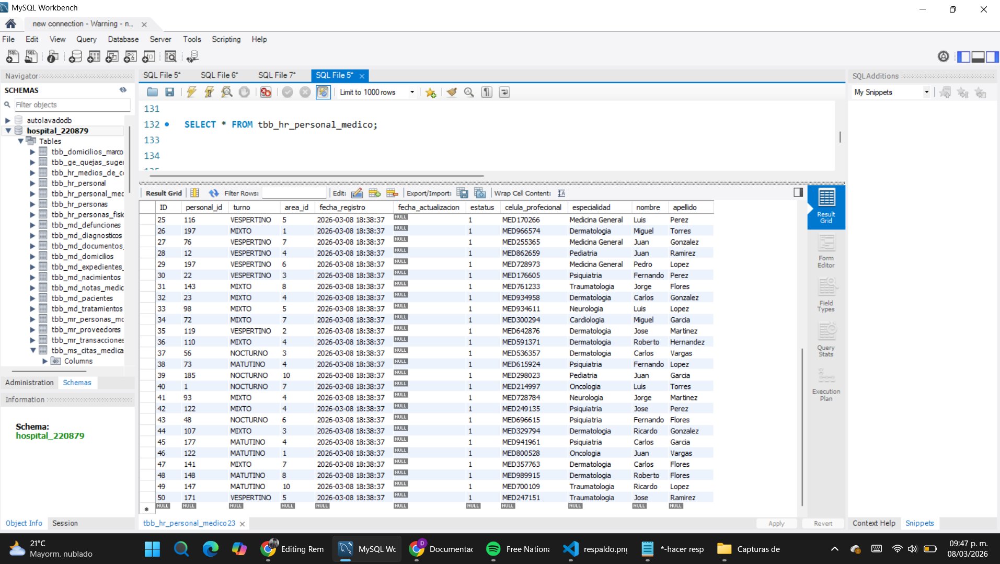
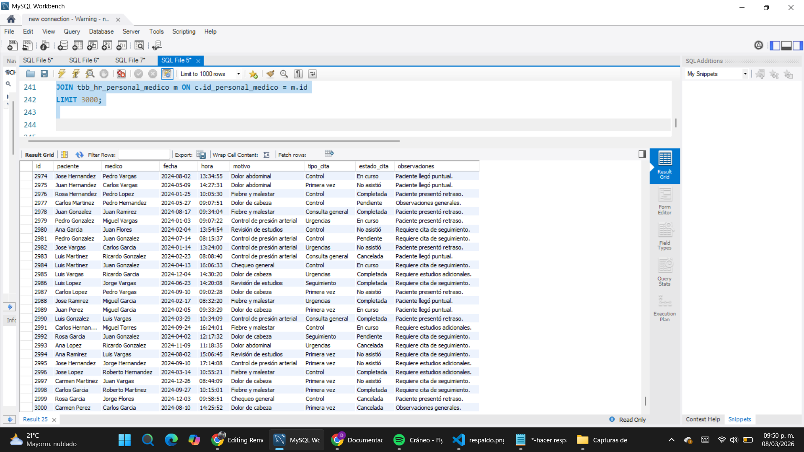

# Remedial_Unidad1_220879
Examen remedial de SQL: generación de pacientes, médicos y citas médicas en la base hospital_220879.

**Examen remedial:Este examen tiene como obejetivo demosastrar habilidades en la administracion de bases de datps, incluyendo
(respaldo, generacion de datos de prueba y documentacion en git) de la base de datos hospital_220879.

## 1 - Respaldo de base de datos
Antes de cualquier cambio, se hizo el resáldo de la base de datos para asegurara que no se pierdan datos reales.

  
*Captura del respaldo de la base de datos.*

---

## 2 - Implementacion de procedimientos de generacion de pacientes 
  - generar_pacientes(cantidad INT): genera pacientes aleatorios.
  - generar_medicos(cantidad INT): genera médicos aleatorios.
  - generar_citas_medicas(cantidad INT): genera citas médicas relacionando pacientes y médicos.

  
*Captura mostrando los procedimientos implementados por el equipo.*

---

## 3 - Generación de 1000 pacientes
Se ejecutó el procedimiento generar_pacientes(1000) para poblar la tabla de pacientes con datos.

---

## 4 - Generación de 50 médicos
Se ejecutó el procedimiento generar_medicos(50) para poblar la tabla de médicos con datos. Esto permite tener personal médico disponible para relacionar con las citas médicas.

--

## 5 - Generación de 3000 citas médicas
Se ejecutó el procedimiento generar_citas_medicas(3000) para poblar la tabla de citas médicas. Cada cita se vincula aleatoriamente a un paciente y un médico existente, incluyendo fecha, hora, motivo, tipo y estado de la cita.

 

